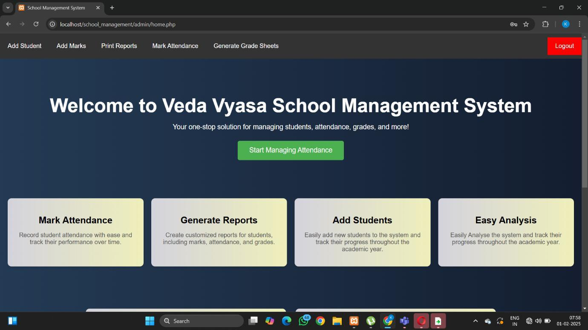
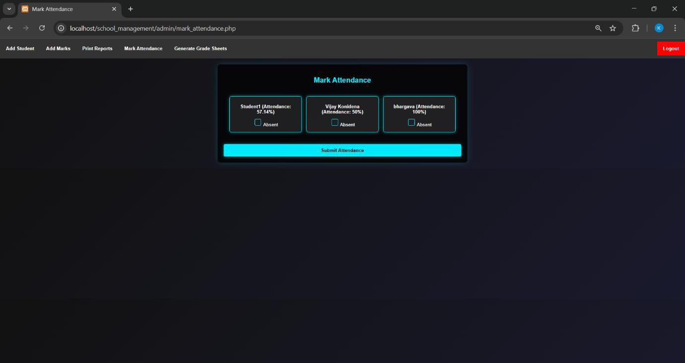
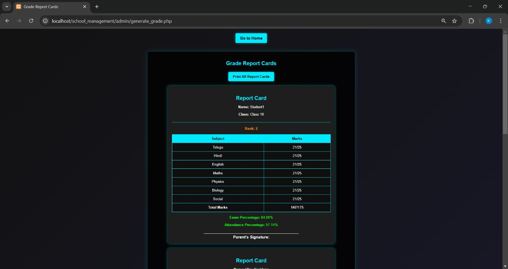
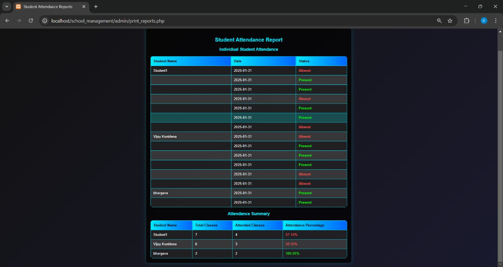

# 📚 School Management System

A simple yet efficient **School Management System** built to handle core academic data such as **marks**, **attendance**, and generate detailed **grade sheets and reports** for students.

---
 
 
 
 
  
## 🚀 Features

- 🔢 **Marks Management**  
  Add, update, and view student marks for different subjects and exams.

- 📅 **Attendance Tracking**  
  Maintain daily/subject-wise attendance and generate attendance reports.

- 📄 **Grade Sheet Generation**  
  Automatically generate student-wise grade sheets based on marks and attendance.

- 📊 **Reports & Insights**  
  Export performance and attendance reports in printable format.

---

## 🛠️ Tech Stack

- **Frontend**: HTML, CSS, JavaScript  
- **Backend**: PHP  
- **Database**: MySQL

---

